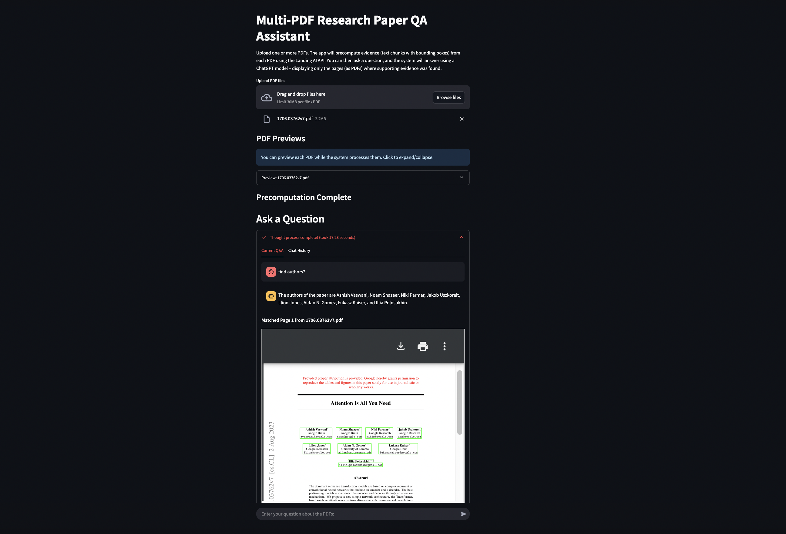

# Multi-PDF Research Paper QA Assistant (SDK Edition)

This application allows you to upload multiple PDF research papers and ask questions about their content. The system leverages the agentic-doc SDK from Landing AI to extract text, tables, and figures from the PDFs, and uses OpenAI's GPT-4o model to generate accurate answers with visual evidence.



## Features

- **Multiple PDF Support**: Upload several PDF files simultaneously
- **Document Analysis**: Extracts text, tables, and figures from PDFs using Landing AI's agentic-doc SDK
- **Question Answering**: Ask questions about the content of your PDFs
- **Visual Evidence**: See exactly where in the document the answers come from with highlighted bounding boxes
- **Reasoning Transparency**: Includes detailed reasoning explaining how the answer was derived
- **Optimized Parallel Processing**: Efficiently processes documents with maximum parallelism
- **Large Document Support**: Handles PDFs of any size through automatic chunking and reassembly
- **Chat History**: Maintains conversation history for reference

## Available Versions

This repository contains two implementation approaches:

- **app.py**: The original version that interacts directly with the Landing AI REST API
  - More complex error handling
  - Manual chunking of large PDFs
  - Direct HTTP request management

- **sdk-app.py**: The improved SDK version that uses the agentic-doc Python library
  - Cleaner, more maintainable code
  - Automatic handling of large PDFs
  - Built-in error handling and retries
  - Optimized parallel processing

## Installation

1. Clone this repository:
```bash
git clone https://github.com/yourusername/multi-pdf-qa-assistant.git
cd multi-pdf-qa-assistant
```

2. Install required dependencies:
```bash
pip install -r requirements.txt
```

3. Create a `.env` file in the project root directory with your API keys:
```
VISION_AGENT_API_KEY=your_api_key
OPENAI_API_KEY=your_openai_api_key
```

## Usage

1. Run the Streamlit application (SDK version recommended):
```bash
streamlit run sdk-app.py
```

2. Open the provided URL in your web browser (typically http://localhost:8501)

3. Upload one or more PDF research papers using the file uploader

4. Wait for the system to precompute evidence from the PDFs (the SDK version uses maximum parallelism for faster processing)

5. Enter your question in the chat input box

6. View the answer, reasoning, and supporting evidence highlighted in the PDF pages

## Requirements

- Python 3.9+ (required by the agentic-doc SDK)
- Landing AI API key (for document analysis)
- OpenAI API key (for question answering)
- Sufficient credit balance in your Landing AI account (you get 10usd free balance when you sign-up)

## Dependencies

- `agentic-doc`: Landing AI's Python SDK for document extraction
- `streamlit`: Web application framework
- `openai`: OpenAI API client for GPT-4o
- `PyMuPDF`: PDF rendering
- `opencv-python`: Image processing
- `Pillow`: Image handling
- `fpdf`: PDF generation
- `python-dotenv`: Environment variable management
- `numpy`: Numerical operations

## How It Works

1. **SDK Optimization**: The application configures the SDK with optimal parallelism (BATCH_SIZE=20, MAX_WORKERS=5)
2. **PDF Processing**: PDFs are processed in parallel using the SDK's built-in capabilities
3. **Evidence Extraction**: Text, tables, and figures are extracted with their positions (bounding boxes)
4. **Question Analysis**: When a user asks a question, the system searches through the extracted evidence
5. **Answer Generation**: GPT-4o analyzes the relevant evidence and generates a comprehensive answer
6. **Visual Evidence**: The system highlights the exact locations in the PDF where the answer was found
7. **Result Presentation**: The answer, reasoning, and annotated PDF pages are displayed to the user

## Examples

Ask questions like:
- "what are the main findings of this research?"
- "find authors of the paper?"
- "explain figure 1 from the paper?"
- "compare table 1 from this paper and table 3 from the other paper?"

## License

[MIT License](LICENSE)

## Contributing

Contributions are welcome! Please feel free to submit a Pull Request.

## Acknowledgements

- [Landing AI](https://landing.ai/) for their agentic-doc SDK and API
- [OpenAI](https://openai.com/) for their GPT-4o model
- [Streamlit](https://streamlit.io/) for the web application framework

## Contact

For questions or support, please open an issue in the GitHub repository.
